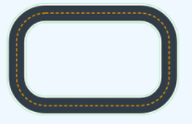
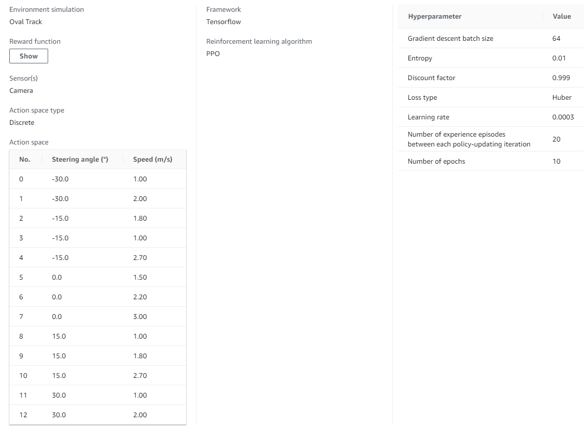
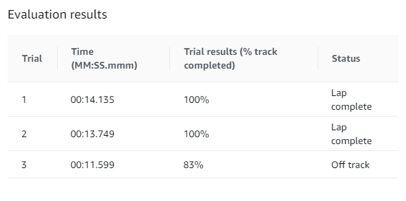
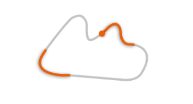
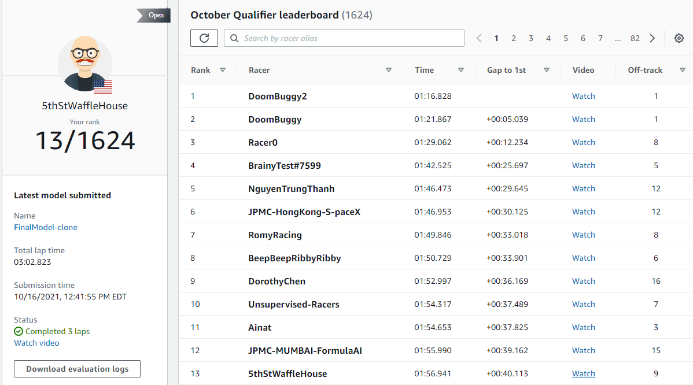

# My AWS DeepRacer Model
* [Training Configuration](#training-configuration)
* [Reward Function](#reward-function)
* [Evaluation Results and October Qualifier](#evaluation-results-and-october-qualifier)

# Training Configuration

#### It was then cloned and the reward function was tweaked to penalize going off the track. Then the model was trained on the oval circuit which is a much easier course to complete. The cloned model was trained on this track for 7 hours.
 

#### The hyperparameters and the discrete action space can be seen in the picture below.

# Reward Function

#### This model uses multiple data inputs from the single camera set up. This set up reduced the amount of time to train a well rounded model. The reward function can be seen in the following file:
[Reward Function](https://github.com/jschaedler/AWS-DeepRacer/blob/master/RewardFuction.py)

#### After triaing on the oval track the first evaluation was performed on the model. The model completed 100% of the race without going off track 2/3 times. The results can be seen below:
 

#### Upon submission to the October Qualifier the model was tested on a new, more dificult track called the Expedition Loop track seen below. 
 

#### The model placed 13th out of 1626 submittions and the times can be seen below:
  

